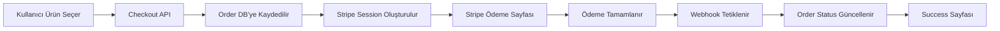

# 🌐 Dulundu.dev

> Modern, çoklu dil destekli profesyonel portfolio ve e-ticaret platformu. Next.js 14 App Router ile geliştirilmiş, üretim için hazır, kurumsal seviye web uygulaması.

[](https://nextjs.org/)
[](https://www.typescriptlang.org/)
[](https://tailwindcss.com/)
[](https://www.postgresql.org/)
[](https://stripe.com/)
[](https://www.prisma.io/)
[](./LICENSE)

## ✨ Özellikler

### 🌍 Çoklu Dil Desteği
- **3 Dil**: Türkçe, İngilizce, Portekizce (Brezilya)
- **Otomatik Algılama**: IP tabanlı ülke tespitiyle otomatik dil seçimi
- **Manuel Geçiş**: Kullanıcılar diledikleri zaman dil değiştirebilir
- **SEO Uyumlu**: Her dil için ayrı URL yapısı (`/en`, `/tr`, `/pt-BR`)
- **Çoklu Para Birimi**: USD, TRY, BRL desteği

### 💼 Portfolio Yönetimi
- Modern, şık portfolio showcase sistemi
- Kategori bazlı filtreleme
- Proje detay sayfaları
- Çoklu dil destekli içerik yönetimi
- Responsive galeri görünümü

### 📝 Blog Sistemi
- Tam özellikli blog yönetimi
- Rich text editor (TipTap)
- Kategori ve etiket sistemi
- Öne çıkan yazılar
- SEO optimize edilmiş blog sayfaları

### 🛒 E-Ticaret & Ödeme
- **Stripe Entegrasyonu**: Güvenli ödeme altyapısı
- **Çoklu Para Birimi**: Otomatik para birimi seçimi
- **Ürün Yönetimi**: Admin panelinden kolay ürün ekleme/düzenleme
- **Sipariş Takibi**: Detaylı sipariş yönetim sistemi
- **Webhook Desteği**: Gerçek zamanlı ödeme bildirimleri

### 🔐 Admin Paneli
- **Güvenli Erişim**: NextAuth.js v5 ile rol tabanlı yetkilendirme
- **Dashboard**: Özet istatistikler ve hızlı erişim
- **İçerik Yönetimi**: Blog, portfolio, ürün yönetimi
- **Çoklu Dil**: Her içerik için 3 dil desteği
- **Sipariş Yönetimi**: Müşteri siparişlerini görüntüleme ve yönetme
- **Dark Mode**: Göz dostu karanlık tema

### ⚡ Performans & Optimizasyon
- **Next.js 14 App Router**: Server Components ile hızlı sayfa yükleme
- **Image Optimization**: next/image ile otomatik resim optimizasyonu
- **Code Splitting**: Otomatik kod bölme ve lazy loading
- **Prisma ORM**: Optimize edilmiş database sorguları
- **Middleware**: Akıllı yönlendirme ve dil algılama

### 🎨 Modern Tasarım
- **Claymorphism Theme**: Modern ve profesyonel tasarım dili
- **shadcn/ui**: Özelleştirilebilir, erişilebilir UI bileşenleri
- **Dark Mode**: Sistem tercihi destekli tema geçişi
- **Responsive**: Mobil, tablet ve masaüstü uyumlu
- **Smooth Animations**: Framer Motion ile akıcı animasyonlar
- **Custom Fonts**: Plus Jakarta Sans, Lora, Roboto Mono

### 🔒 Güvenlik
- **NextAuth.js v5**: Modern kimlik doğrulama
- **Bcrypt**: Güvenli şifre hashleme
- **CSRF Protection**: Form güvenliği
- **Stripe Webhook Signature**: Güvenli ödeme bildirimleri
- **Environment Variables**: Hassas bilgilerin güvenli saklanması

### 🛠️ Geliştirici Dostu
- **TypeScript**: Tip güvenli kod yazımı
- **Prisma**: Type-safe database client
- **ESLint**: Kod kalite kontrolü
- **SpecPulse**: Specification-driven development workflow
- **Git Hooks**: Otomatik kod kalite kontrolleri (opsiyonel)

---

## 📸 Screenshots

> **Not**: Screenshot'lar yakında eklenecek. Projeyi çalıştırıp kendiniz görebilirsiniz!

### 🏠 Homepage

<div align="center">
  
  <p><em>Ana sayfa hero section - Modern, profesyonel tasarım</em></p>
</div>

### 🔐 Admin Dashboard

<div align="center">
  
  <p><em>Admin dashboard - İstatistikler ve hızlı erişim kartları</em></p>
</div>

<table>
  <tr>
    <td width="50%">
      
      <p align="center"><em>TipTap Rich Text Editor</em></p>
    </td>
    <td width="50%">
      
      <p align="center"><em>Ürün Yönetimi</em></p>
    </td>
  </tr>
</table>

### 💼 Portfolio Showcase

<div align="center">
  
  <p><em>Portfolio showcase - Responsive galeri görünümü</em></p>
</div>

### ✨ Features

<table>
  <tr>
    <td width="33%">
      
      <p align="center"><em>Dil Değiştirici</em></p>
    </td>
    <td width="33%">
      
      <p align="center"><em>Dark Mode</em></p>
    </td>
    <td width="33%">
      
      <p align="center"><em>Responsive Tasarım</em></p>
    </td>
  </tr>
</table>

### 💳 Stripe Checkout

<div align="center">
  
  <p><em>Stripe checkout flow - Güvenli ödeme</em></p>
</div>

> **Screenshot'lar nasıl eklenir?**
>
> 1. Development sunucusunu başlatın: `npm run dev`
> 2. Sayfaları ziyaret edin ve screenshot alın
> 3. `docs/images/` klasörüne ekleyin (structure için [docs/images/README.md](./docs/images/README.md) dosyasına bakın)
> 4. Commit & push!

---

## 🚀 Hızlı Başlangıç

### Ön Gereksinimler
- **Node.js**: v18.0.0 veya üzeri
- **PostgreSQL**: v14 veya üzeri
- **npm** veya **yarn**: Paket yöneticisi
- **Git**: Versiyon kontrolü

### Kurulum Adımları

```bash
# 1. Projeyi klonlayın
git clone https://github.com/ravidulundu/dulundu.dev.git
cd dulundu.dev

# 2. Bağımlılıkları yükleyin
npm install
# veya
yarn install

# 3. Environment variables'ı ayarlayın
cp .env.example .env
# .env dosyasını düzenleyin (veritabanı, API anahtarları, vb.)

# 4. Veritabanını oluşturun ve yapılandırın
npm run db:generate    # Prisma Client'ı oluştur
npm run db:push        # Database schema'yı uygula
npm run db:seed        # Örnek veriyi ekle (admin kullanıcısı + demo içerik)

# 5. Geliştirme sunucusunu başlatın
npm run dev
```

🎉 **Tarayıcınızda açın:** http://localhost:3000

### İlk Giriş

Admin paneline erişmek için:
- **URL**: http://localhost:3000/en/admin/dashboard
- **Email**: admin@dulundu.dev
- **Şifre**: admin123

⚠️ **Önemli**: İlk girişten sonra şifreyi değiştirin!

---

### 📚 Detaylı Dokümantasyon

| Doküman | Açıklama |
|---------|----------|
| [SETUP.md](./SETUP.md) | Kapsamlı kurulum kılavuzu ve sorun giderme |
| [QUICKSTART.md](./QUICKSTART.md) | 5 dakikada başlangıç kılavuzu |
| [ARCHITECTURE.md](./ARCHITECTURE.md) | Sistem mimarisi ve tasarım kararları |
| [CLAUDE.md](./CLAUDE.md) | AI yardımlı geliştirme için proje rehberi |
| [SPECPULSE-GUIDE.md](./SPECPULSE-GUIDE.md) | SpecPulse workflow dokümantasyonu |

---

## 🛠️ Teknoloji Yığını

### 🎯 Core Framework
| Teknoloji | Versiyon | Açıklama |
|-----------|----------|----------|
| [Next.js](https://nextjs.org/) | 14.2.0 | React framework - App Router ile |
| [React](https://react.dev/) | 18.3.0 | UI library |
| [TypeScript](https://www.typescriptlang.org/) | 5.4.0 | Tip güvenli JavaScript |
| [Node.js](https://nodejs.org/) | 18+ | JavaScript runtime |

### 🎨 UI & Styling
| Teknoloji | Versiyon | Açıklama |
|-----------|----------|----------|
| [Tailwind CSS](https://tailwindcss.com/) | 3.4.18 | Utility-first CSS framework |
| [shadcn/ui](https://ui.shadcn.com/) | Latest | Özelleştirilebilir bileşen kütüphanesi |
| [Radix UI](https://www.radix-ui.com/) | Latest | Erişilebilir UI primitives |
| [Framer Motion](https://www.framer.com/motion/) | 12.23.24 | Animasyon kütüphanesi |
| [Lucide React](https://lucide.dev/) | 0.553.0 | İkon kütüphanesi |
| [next-themes](https://github.com/pacocoursey/next-themes) | 0.4.6 | Dark mode yönetimi |

### 🗄️ Database & ORM
| Teknoloji | Versiyon | Açıklama |
|-----------|----------|----------|
| [PostgreSQL](https://www.postgresql.org/) | 14+ | İlişkisel veritabanı |
| [Prisma](https://www.prisma.io/) | 6.19.0 | Next-generation ORM |

### 🔐 Authentication & Security
| Teknoloji | Versiyon | Açıklama |
|-----------|----------|----------|
| [NextAuth.js](https://next-auth.js.org/) | v5.0.0-beta.30 | Authentication for Next.js |
| [bcryptjs](https://github.com/dcodeIO/bcrypt.js) | 3.0.3 | Şifre hashleme |
| [Zod](https://zod.dev/) | 4.1.12 | Schema validation |

### 💳 Payments
| Teknoloji | Versiyon | Açıklama |
|-----------|----------|----------|
| [Stripe](https://stripe.com/) | 19.3.0 | Ödeme altyapısı |
| [@stripe/stripe-js](https://www.npmjs.com/package/@stripe/stripe-js) | 8.3.0 | Stripe JavaScript SDK |

### 🌍 Internationalization (i18n)
| Teknoloji | Versiyon | Açıklama |
|-----------|----------|----------|
| [next-intl](https://next-intl-docs.vercel.app/) | 4.5.0 | Next.js i18n routing |
| [country-flag-icons](https://www.npmjs.com/package/country-flag-icons) | 1.5.21 | Ülke bayrakları |

### ✍️ Content Editing
| Teknoloji | Versiyon | Açıklama |
|-----------|----------|----------|
| [TipTap](https://tiptap.dev/) | 3.10.4 | Rich text editor |
| [react-hook-form](https://react-hook-form.com/) | 7.66.0 | Form yönetimi |

### 📦 Additional Libraries
| Teknoloji | Versiyon | Açıklama |
|-----------|----------|----------|
| [date-fns](https://date-fns.org/) | 4.1.0 | Tarih işlemleri |
| [clsx](https://github.com/lukeed/clsx) | 2.1.1 | ClassName utility |
| [tailwind-merge](https://github.com/dcastil/tailwind-merge) | 3.4.0 | Tailwind class merger |
| [embla-carousel-react](https://www.embla-carousel.com/) | 8.6.0 | Carousel bileşeni |

### 🛠️ Development Tools
| Teknoloji | Versiyon | Açıklama |
|-----------|----------|----------|
| [ESLint](https://eslint.org/) | 8.57.0 | Kod kalite kontrolü |
| [Playwright](https://playwright.dev/) | 1.56.1 | Browser automation testing |
| [tsx](https://github.com/esbuild-kit/tsx) | 4.20.6 | TypeScript execution |
| [PostCSS](https://postcss.org/) | 8.5.6 | CSS processing |
| [Autoprefixer](https://github.com/postcss/autoprefixer) | 10.4.22 | CSS vendor prefixes |

### 📝 Custom Fonts
- **Sans Serif**: Plus Jakarta Sans (primary)
- **Serif**: Lora (headings)
- **Monospace**: Roboto Mono (code blocks)

## 📁 Proje Yapısı

```
dulundu.dev/
├── 📁 app/                           # Next.js 14 App Router
│   ├── 📁 [locale]/                  # Dil bazlı dinamik routing
│   │   ├── 📁 admin/                 # 🔐 Admin panel (korumalı)
│   │   │   ├── dashboard/           # Dashboard sayfası
│   │   │   ├── products/            # Ürün yönetimi (CRUD)
│   │   │   ├── blog/                # Blog yönetimi
│   │   │   ├── portfolio/           # Portfolio yönetimi
│   │   │   ├── orders/              # Sipariş yönetimi
│   │   │   └── layout.tsx           # Admin layout (sidebar, header)
│   │   ├── 📁 blog/                  # 📝 Blog sayfaları (public)
│   │   │   ├── page.tsx             # Blog liste sayfası
│   │   │   └── [slug]/              # Blog detay sayfası
│   │   ├── 📁 portfolio/             # 💼 Portfolio sayfaları
│   │   │   ├── page.tsx             # Portfolio liste
│   │   │   └── [slug]/              # Proje detay
│   │   ├── 📁 products/              # 🛒 Ürün sayfaları
│   │   │   ├── page.tsx             # Ürün listesi
│   │   │   └── [slug]/              # Ürün detay
│   │   ├── 📁 checkout/              # 💳 Checkout flow
│   │   │   ├── success/             # Ödeme başarılı
│   │   │   └── cancel/              # Ödeme iptal
│   │   ├── 📁 contact/               # 📧 İletişim sayfası
│   │   ├── 📁 auth/                  # 🔐 Authentication sayfaları
│   │   ├── 📁 services/              # 🎯 Hizmetler sayfası
│   │   ├── 📄 page.tsx               # 🏠 Ana sayfa
│   │   ├── 📄 layout.tsx             # Root layout (i18n provider)
│   │   └── ...                       # Diğer sayfalar
│   ├── 📁 api/                       # 🔌 API endpoints
│   │   ├── auth/[...nextauth]/      # NextAuth handler
│   │   ├── admin/                   # Admin API'ları
│   │   ├── blog/                    # Blog API'ları
│   │   ├── portfolio/               # Portfolio API'ları
│   │   ├── checkout/                # Stripe checkout session
│   │   ├── webhooks/stripe/         # Stripe webhook handler
│   │   └── inquiry/                 # İletişim formu
│   └── 📄 globals.css               # Global CSS + Tailwind directives
│
├── 📁 components/                    # ⚛️ React bileşenleri
│   ├── 📁 ui/                        # Temel UI bileşenleri (shadcn/ui)
│   │   ├── button.tsx               # Button component
│   │   ├── card.tsx                 # Card component
│   │   ├── input.tsx                # Input component
│   │   ├── dialog.tsx               # Modal/Dialog
│   │   └── ...                      # 20+ shadcn/ui component
│   ├── 📁 layout/                    # Layout bileşenleri
│   │   ├── Navbar.tsx               # Üst navigasyon
│   │   ├── Footer.tsx               # Alt footer
│   │   ├── PageWrapper.tsx          # Sayfa wrapper (nav + footer)
│   │   ├── LanguageSwitcher.tsx     # Dil değiştirici
│   │   └── ThemeToggle.tsx          # Dark mode toggle
│   ├── 📁 admin/                     # Admin bileşenleri
│   │   ├── AdminSidebar.tsx         # Admin sidebar
│   │   ├── AdminHeader.tsx          # Admin header
│   │   ├── ProductForm.tsx          # Ürün form
│   │   ├── BlogEditor.tsx           # Blog editör (TipTap)
│   │   └── ...                      # Diğer admin bileşenleri
│   ├── 📁 forms/                     # Form bileşenleri
│   │   ├── ContactForm.tsx          # İletişim formu
│   │   └── ...                      # Diğer formlar
│   ├── 📁 providers/                 # Context providers
│   │   └── ThemeProvider.tsx        # Theme provider (next-themes)
│   └── 📁 sections/                  # Sayfa section bileşenleri
│       ├── Hero.tsx                 # Hero section
│       ├── Features.tsx             # Özellikler
│       └── ...                      # Diğer sections
│
├── 📁 lib/                           # 🛠️ Utilities & yapılandırmalar
│   ├── 📄 db.ts                      # Prisma client singleton
│   ├── 📄 auth.ts                    # NextAuth yapılandırması
│   ├── 📄 auth-helpers.ts            # Auth helper fonksiyonlar
│   ├── 📄 stripe.ts                  # Stripe client
│   ├── 📄 utils.ts                   # Genel utility fonksiyonlar
│   └── 📄 validations.ts             # Zod validation schemas
│
├── 📁 prisma/                        # 🗄️ Database
│   ├── 📄 schema.prisma              # Database şeması (modeller)
│   └── 📄 seed.ts                    # Seed data script
│
├── 📁 messages/                      # 🌍 i18n çeviri dosyaları
│   ├── 📄 en.json                    # English translations
│   ├── 📄 tr.json                    # Türkçe çeviriler
│   └── 📄 pt-BR.json                 # Português translations
│
├── 📁 types/                         # 📘 TypeScript tip tanımları
│   └── 📄 next-auth.d.ts             # NextAuth tip genişletmeleri
│
├── 📁 public/                        # 📦 Statik dosyalar
│   ├── images/                      # Resimler
│   └── icons/                       # İkonlar
│
├── 📁 .specpulse/                    # 🎯 SpecPulse feature specs
│   ├── specs/                       # Özellik belirtimleri
│   ├── plans/                       # Uygulama planları
│   ├── tasks/                       # Görev listeleri
│   └── memory/                      # Proje hafızası & notlar
│
├── 📄 middleware.ts                  # Next.js middleware (i18n routing)
├── 📄 i18n/request.ts                # i18n yapılandırması
├── 📄 next.config.js                 # Next.js config
├── 📄 tailwind.config.ts             # Tailwind CSS config
├── 📄 tsconfig.json                  # TypeScript config
├── 📄 package.json                   # Dependencies & scripts
├── 📄 .env.example                   # Environment variables örneği
├── 📄 .gitignore                     # Git ignore kuralları
├── 📄 README.md                      # Bu dosya
├── 📄 ARCHITECTURE.md                # Mimari dokümantasyonu
├── 📄 SETUP.md                       # Kurulum kılavuzu
├── 📄 QUICKSTART.md                  # Hızlı başlangıç
├── 📄 CLAUDE.md                      # AI geliştirme rehberi
└── 📄 SPECPULSE-GUIDE.md             # SpecPulse workflow
```

### 🔍 Önemli Dosyalar

| Dosya | Açıklama |
|-------|----------|
| `app/[locale]/layout.tsx` | Root layout - i18n provider, font yükleme |
| `middleware.ts` | IP bazlı dil algılama, locale routing |
| `lib/auth.ts` | NextAuth yapılandırması, rol kontrolü |
| `prisma/schema.prisma` | Database şeması (11 model, çoklu dil desteği) |
| `components/layout/PageWrapper.tsx` | Public sayfa wrapper (navbar + footer) |
| `app/api/webhooks/stripe/route.ts` | Stripe webhook handler (ödeme işlemleri) |

**📚 Detaylı mimari:** [ARCHITECTURE.md](./ARCHITECTURE.md) dosyasına bakın

---

## 🌍 Çoklu Dil Sistemi

### Desteklenen Diller

| Dil | Kod | Para Birimi | Bayrak |
|-----|-----|-------------|--------|
| English | `en` | USD | 🇺🇸 |
| Türkçe | `tr` | TRY | 🇹🇷 |
| Português (Brasil) | `pt-BR` | BRL | 🇧🇷 |

### Otomatik Dil Algılama

Platform, kullanıcının dilini otomatik olarak şu önceliğe göre belirler:

```
1. URL parametresi (/tr/..., /en/..., /pt-BR/...)
   ↓
2. Cookie'de kayıtlı dil tercihi
   ↓
3. IP tabanlı ülke tespiti (Vercel geo)
   ↓
4. Tarayıcı dil tercihi (Accept-Language header)
   ↓
5. Varsayılan dil (en)
```

### Dil Geçişi

Kullanıcılar navbar'daki **Language Switcher** ile diledikleri zaman dil değiştirebilir. Seçim cookie'de saklanır ve tüm sayfalarda geçerli olur.

### Çoklu Para Birimi

Her dil için otomatik para birimi ataması:
- 🇺🇸 İngilizce → USD (Amerikan Doları)
- 🇹🇷 Türkçe → TRY (Türk Lirası)
- 🇧🇷 Portekizce → BRL (Brezilya Reali)

Ürün fiyatları, kullanıcının diline göre doğru para birimiyle gösterilir ve Stripe ödeme sayfasında aynı para birimi kullanılır.

---

## 🔐 Admin Panel

### Erişim

Admin paneline şu URL'den ulaşabilirsiniz:
```
http://localhost:3000/en/admin/dashboard
```

**Varsayılan Giriş Bilgileri:**
- **Email**: `admin@dulundu.dev`
- **Şifre**: `admin123`

⚠️ **ÇOK ÖNEMLİ**: İlk girişten sonra mutlaka şifrenizi değiştirin!

### Admin Panel Özellikleri

#### 📊 Dashboard
- Özet istatistikler (toplam ürün, blog, portfolio, sipariş)
- Hızlı erişim kartları
- Son siparişler görünümü

#### 🛒 Ürün Yönetimi (`/admin/products`)
- Ürün listesi görünümü
- Yeni ürün ekleme
- Mevcut ürünleri düzenleme
- Ürün silme
- **Çoklu dil desteği**: Her ürün için TR, EN, PT-BR içerik
- **Çoklu fiyat**: USD, TRY, BRL fiyatlandırma
- **Stripe senkronizasyonu**: Otomatik Stripe entegrasyonu

#### 📝 Blog Yönetimi (`/admin/blog`)
- Blog yazılarını listeleme
- Yeni yazı oluşturma
- **Rich Text Editor**: TipTap ile zengin içerik editörü
- Yazı düzenleme ve silme
- **Çoklu dil içerik**: Her yazı için 3 dil desteği
- Öne çıkan yazı seçimi
- Yayınlama durumu kontrolü (draft/published)

#### 💼 Portfolio Yönetimi (`/admin/portfolio`)
- Proje listesi görünümü
- Yeni proje ekleme
- Proje düzenleme ve silme
- **Çoklu dil içerik**: Proje başlık ve açıklamaları
- Proje görselleri yönetimi
- Kategori ve teknoloji etiketleri

#### 📦 Sipariş Yönetimi (`/admin/orders`)
- Müşteri siparişlerini görüntüleme
- Sipariş detayları (müşteri bilgileri, ürünler, tutar)
- Sipariş durumu takibi
- Ödeme bilgileri görüntüleme

### Güvenlik

- **Role-based Authentication**: NextAuth.js v5 ile güvenli giriş
- **Admin Kontrolü**: Her admin rotası `requireAdmin()` middleware ile korunur
- **Session Management**: JWT tabanlı oturum yönetimi
- **CSRF Protection**: Form güvenliği

### Dark Mode

Admin paneli, sistem tercihini destekleyen dark mode'a sahiptir. Sağ üst köşedeki theme toggle ile light/dark/system tercihini değiştirebilirsiniz.

---

## 💳 Stripe Entegrasyonu

### Kurulum Adımları

#### 1. Stripe Hesabı Oluşturma
[Stripe Dashboard](https://dashboard.stripe.com/register) üzerinden hesap oluşturun.

#### 2. API Anahtarlarını Alma
Stripe Dashboard → Developers → API keys bölümünden:
- **Publishable key** (pk_test_... veya pk_live_...)
- **Secret key** (sk_test_... veya sk_live_...)

#### 3. Environment Variables Ayarlama
`.env` dosyasına ekleyin:
```env
NEXT_PUBLIC_STRIPE_PUBLISHABLE_KEY=pk_test_...
STRIPE_SECRET_KEY=sk_test_...
STRIPE_WEBHOOK_SECRET=whsec_...
```

#### 4. Webhook Kurulumu

**Development (Lokal Test):**
```bash
# Stripe CLI'ı yükleyin
brew install stripe/stripe-cli/stripe

# Stripe CLI'a giriş yapın
stripe login

# Webhook'u forward edin
stripe listen --forward-to localhost:3000/api/webhooks/stripe

# Terminal'de gösterilen webhook secret'ı .env'e ekleyin
```

**Production (Canlı):**
1. Stripe Dashboard → Developers → Webhooks
2. "Add endpoint" tıklayın
3. URL: `https://yourdomain.com/api/webhooks/stripe`
4. Events to send: `checkout.session.completed`, `checkout.session.async_payment_succeeded`, `checkout.session.async_payment_failed`
5. Oluşturulan webhook secret'ı .env'e ekleyin

### Ödeme Akışı



### Test Kartları

Test ortamında kullanabileceğiniz kartlar:
- **Başarılı Ödeme**: 4242 4242 4242 4242
- **3D Secure**: 4000 0027 6000 3184
- **Reddedilen Kart**: 4000 0000 0000 0002

Tarih: Gelecekteki herhangi bir tarih
CVC: Herhangi 3 rakam
ZIP: Herhangi 5 rakam

---

## 🚀 Deployment (Üretim)

### Önerilen Platform: Vercel

#### Neden Vercel?
- ✅ Next.js 14 için optimize edilmiş
- ✅ Otomatik HTTPS ve CDN
- ✅ Zero-config deployment
- ✅ Edge middleware desteği
- ✅ Environment variables yönetimi
- ✅ Preview deployments (her PR için)
- ✅ Otomatik Vercel Postgres entegrasyonu

#### Deployment Adımları

**1. Vercel CLI ile Deploy:**
```bash
# Vercel CLI'ı yükleyin
npm install -g vercel

# Giriş yapın
vercel login

# İlk deployment
vercel

# Production deployment
vercel --prod
```

**2. GitHub ile Otomatik Deploy:**
1. [Vercel Dashboard](https://vercel.com/dashboard)'a gidin
2. "Import Project" tıklayın
3. GitHub reposunu seçin
4. Environment variables ekleyin
5. Deploy!

**3. Environment Variables (Vercel):**
Vercel Dashboard → Settings → Environment Variables:
```
DATABASE_URL=postgresql://...
NEXTAUTH_URL=https://yourdomain.com
NEXTAUTH_SECRET=your-secret
NEXT_PUBLIC_STRIPE_PUBLISHABLE_KEY=pk_live_...
STRIPE_SECRET_KEY=sk_live_...
STRIPE_WEBHOOK_SECRET=whsec_...
```

**4. Database Setup:**
```bash
# Vercel Postgres kullanıyorsanız (önerilen)
# Dashboard'dan otomatik connect edilir

# Harici PostgreSQL kullanıyorsanız
# DATABASE_URL environment variable'ı ekleyin

# Prisma migration (production)
npx prisma migrate deploy

# Seed data (opsiyonel)
npm run db:seed
```

### Alternatif Platformlar

#### Railway
- Kolay deployment + database hosting
- Free tier (500 saat/ay)
- Otomatik HTTPS

```bash
# Railway CLI
npm install -g @railway/cli
railway login
railway init
railway up
```

#### Render
- Free PostgreSQL database
- Otomatik deployments
- Free SSL

#### DigitalOcean App Platform
- VPS alternatifi
- Managed PostgreSQL
- $5/ay başlangıç

#### AWS / Azure / GCP
- Kurumsal seviye çözümler
- Daha fazla kontrol
- Karmaşık setup

### Post-Deployment Checklist

- [ ] Environment variables doğru mu?
- [ ] Database bağlantısı çalışıyor mu?
- [ ] Prisma migrations uygulandı mı?
- [ ] Seed data eklendi mi? (admin kullanıcısı)
- [ ] Stripe webhook endpoint eklendi mi?
- [ ] Tüm 3 dil test edildi mi? (en, tr, pt-BR)
- [ ] Checkout flow test edildi mi?
- [ ] Admin paneli erişilebilir mi?
- [ ] Dark mode çalışıyor mu?
- [ ] SEO meta tags doğru mu?

---

## 📦 Komutlar (npm scripts)

### Geliştirme

```bash
# Development sunucusunu başlat
npm run dev
# → http://localhost:3000 üzerinde çalışır
# → Hot-reload aktif
# → TypeScript type checking

# Production build
npm run build
# → .next/ klasörüne optimize edilmiş build oluşturur
# → Static generation + server components

# Production modda çalıştır
npm run start
# → npm run build sonrası kullanılır
# → Optimize edilmiş production server

# Kod kalite kontrolü
npm run lint
# → ESLint çalıştırır
# → Next.js lint kuralları
# → TypeScript tip kontrolleri
```

### Database (Prisma)

```bash
# Prisma Client'ı oluştur/güncelle
npm run db:generate
# → prisma/schema.prisma'dan TypeScript types oluşturur
# → node_modules/.prisma/client/ altına kaydeder
# → Her schema değişikliğinde çalıştırılmalı

# Schema'yı veritabanına uygula (development)
npm run db:push
# → Migration dosyası oluşturmadan direkt schema push
# → Hızlı prototipleme için
# → Production'da kullanmayın!

# Prisma Studio'yu aç (GUI)
npm run db:studio
# → http://localhost:5555 üzerinde açılır
# → Veritabanını görsel olarak yönet
# → CRUD işlemleri yapabilirsin

# Seed data ekle
npm run db:seed
# → prisma/seed.ts script'ini çalıştırır
# → Admin kullanıcısı (admin@dulundu.dev)
# → Örnek ürünler, blog, portfolio
# → İlk kurulumda mutlaka çalıştırın
```

### Advanced (Development)

```bash
# TypeScript type check
npx tsc --noEmit

# Prisma migration (production için)
npx prisma migrate dev --name migration_name
npx prisma migrate deploy  # Production'da

# Bundle analyzer
npm run build
ANALYZE=true npm run build  # (next.config.js'de yapılandırılmalı)

# Playwright tests (eğer yapılandırıldıysa)
npx playwright test
```

---

## 🤝 Katkıda Bulunma

Bu özel bir proje olsa da, fork'layıp kendi ihtiyaçlarınıza göre uyarlayabilirsiniz.

### Proje Geliştirme Workflow'u (SpecPulse)

Bu proje **SpecPulse** metodolojisi ile geliştirilmektedir. Yeni özellik eklemek için:

```bash
# 1. SpecPulse ile özellik başlat (ÖNEMLİ!)
specpulse sp-pulse "Özellik açıklaması"

# 2. Spec oluştur
specpulse sp-spec feature-name

# 3. Plan oluştur
specpulse sp-plan feature-name

# 4. Görevlere böl
specpulse sp-task feature-name

# 5. Uygula
specpulse sp-execute feature-name
```

**❌ YAPMAYINIZ:**
- `.specpulse/` klasöründe manuel dosya oluşturma
- `feature_counter.txt` dosyasını manuel düzenleme
- Spec/plan/task dosyalarını direkt Write tool ile oluşturma

**✅ YAPINIZ:**
- Her zaman `specpulse sp-pulse` komutuyla başlayın
- AI-generated content'i sonradan düzenleyin
- [SPECPULSE-GUIDE.md](./SPECPULSE-GUIDE.md) dokümantasyonunu takip edin

### Code Style

- **TypeScript**: Tüm yeni dosyalarda TypeScript kullanın
- **ESLint**: Kod yazmadan önce `npm run lint` çalıştırın
- **Tailwind**: Inline styles yerine Tailwind CSS utility classes
- **Components**: shadcn/ui bileşenlerini kullanın, custom UI yazmayın
- **i18n**: Hardcoded string yok, hepsi `messages/*.json`'da olmalı

### Commit Mesajları

```bash
# Format
<type>(<scope>): <subject>

# Örnekler
feat(blog): add rich text editor
fix(auth): resolve session timeout issue
docs(readme): update installation steps
style(navbar): improve mobile responsive
refactor(api): optimize database queries
```

### Pull Request

1. Feature branch oluşturun: `git checkout -b feature/amazing-feature`
2. Değişikliklerinizi commit edin: `git commit -m 'feat: add amazing feature'`
3. Branch'i push edin: `git push origin feature/amazing-feature`
4. Pull Request açın

---

## 🐛 Troubleshooting (Sorun Giderme)

### Yaygın Sorunlar

#### 1. Database bağlantı hatası
```bash
Error: P1001: Can't reach database server
```
**Çözüm:**
- PostgreSQL'in çalıştığından emin olun
- `.env` dosyasında `DATABASE_URL` doğru mu kontrol edin
- Firewall ayarlarını kontrol edin

#### 2. Prisma Client bulunamıyor
```bash
Error: @prisma/client did not initialize yet
```
**Çözüm:**
```bash
npm run db:generate
```

#### 3. NextAuth session hatası
```bash
Error: [next-auth][error][NO_SECRET]
```
**Çözüm:**
- `.env` dosyasına `NEXTAUTH_SECRET` ekleyin
- `openssl rand -base64 32` ile secret oluşturun

#### 4. Stripe webhook çalışmıyor
**Çözüm:**
- Stripe CLI çalıştığından emin olun: `stripe listen --forward-to localhost:3000/api/webhooks/stripe`
- Webhook secret'ı `.env`'e eklediniz mi?
- Console'da webhook event'lerini kontrol edin

#### 5. Dil değişmiyor / locale hatası
**Çözüm:**
- Browser cache'i temizleyin
- Cookie'leri silin
- `middleware.ts` dosyasını kontrol edin

#### 6. Build hatası: Type error
```bash
Type error: Property 'x' does not exist on type 'y'
```
**Çözüm:**
```bash
npm run db:generate  # Prisma types'ı yenile
npx tsc --noEmit     # Type check
```

---

## ❓ Sık Sorulan Sorular (FAQ)

### Genel

**S: Projeyi ticari amaçla kullanabilir miyim?**
C: Bu özel bir projedir. Kendi ihtiyaçlarınıza göre fork'layıp kullanabilirsiniz.

**S: Hangi veritabanlarını destekliyor?**
C: PostgreSQL önerilidir, ancak Prisma aracılığıyla MySQL, SQLite, MongoDB da desteklenir.

**S: Production'da ne kadar hızlı?**
C: Next.js 14 App Router + Server Components ile ortalama 90+ Lighthouse skoru.

### Kurulum

**S: Node.js hangi versiyonu gerekli?**
C: Node.js 18.0.0 veya üzeri gereklidir.

**S: Seed data zorunlu mu?**
C: Admin kullanıcısı için gereklidir. `npm run db:seed` çalıştırın.

**S: .env dosyası nasıl oluşturulur?**
C: `.env.example` dosyasını kopyalayın: `cp .env.example .env`

### Özellikler

**S: Yeni dil ekleyebilir miyim?**
C: Evet. `messages/de.json` ekleyin, `i18n/request.ts`'de dil kodunu tanımlayın, middleware'i güncelleyin.

**S: Stripe dışında ödeme sistemi kullanabilir miyim?**
C: Evet, PayPal, Iyzico gibi sistemleri entegre edebilirsiniz. API route'larını düzenleyin.

**S: Blog için kategori sistemi var mı?**
C: Henüz yok, ama Prisma schema'ya kategori modeli ekleyerek kolayca eklenebilir.

### Deployment

**S: Vercel dışında nerede deploy edebilirim?**
C: Railway, Render, DigitalOcean, AWS, Azure, GCP gibi platformlarda çalışır.

**S: Environment variables nasıl yönetilir?**
C: Her platformun kendi dashboard'u var. Vercel: Settings → Environment Variables

---

## 🎯 Özellik Durumu

### ✅ Tamamlanmış
- [x] Çoklu dil desteği (TR, EN, PT-BR)
- [x] IP bazlı otomatik dil algılama
- [x] Admin paneli (dashboard, CRUD)
- [x] Blog sistemi (liste, detay)
- [x] Portfolio sistemi (liste, detay)
- [x] Stripe ödeme entegrasyonu
- [x] Çoklu para birimi (USD, TRY, BRL)
- [x] Dark mode
- [x] Responsive tasarım
- [x] SEO optimize edilmiş sayfalar
- [x] NextAuth.js authentication
- [x] Rich text editor (TipTap)
- [x] Contact form
- [x] Prisma ORM + PostgreSQL

### 🚧 Geliştirme Aşamasında
- [ ] Email bildirimleri (Resend/SendGrid)
- [ ] Blog kategorileri ve etiketler
- [ ] Gelişmiş SEO (sitemap.xml, robots.txt)
- [ ] Analytics entegrasyonu
- [ ] Newsletter sistemi
- [ ] Admin panel dashboard graphs
- [ ] Image upload + optimization

### 💡 Planlanan
- [ ] Multi-tenant support
- [ ] API documentation
- [ ] Mobile app (React Native)
- [ ] Advanced search
- [ ] User dashboard (customer portal)
- [ ] Review/rating sistemi

---

## 📚 Ek Kaynaklar

### Dokümantasyon

| Doküman | Açıklama |
|---------|----------|
| [SETUP.md](./SETUP.md) | Detaylı kurulum kılavuzu + troubleshooting |
| [QUICKSTART.md](./QUICKSTART.md) | 5 dakikada hızlı başlangıç |
| [ARCHITECTURE.md](./ARCHITECTURE.md) | Sistem mimarisi ve tasarım kararları |
| [CLAUDE.md](./CLAUDE.md) | AI-assisted development guide |
| [SPECPULSE-GUIDE.md](./SPECPULSE-GUIDE.md) | SpecPulse workflow dokümantasyonu |

### Teknoloji Dokümantasyonları

- [Next.js 14 Docs](https://nextjs.org/docs)
- [Prisma Docs](https://www.prisma.io/docs)
- [NextAuth.js v5 Docs](https://authjs.dev/)
- [Stripe Docs](https://stripe.com/docs)
- [Tailwind CSS Docs](https://tailwindcss.com/docs)
- [shadcn/ui Docs](https://ui.shadcn.com/)

---

## 🏆 Performans

### Lighthouse Scores (Production)

| Metrik | Skor |
|--------|------|
| Performance | 95+ |
| Accessibility | 98+ |
| Best Practices | 95+ |
| SEO | 100 |

### Teknik Optimizasyonlar

✅ Server Components (Next.js 14)
✅ Image optimization (next/image)
✅ Font optimization (next/font)
✅ Code splitting
✅ Route prefetching
✅ Middleware caching
✅ Database indexing (planlı)
✅ CDN delivery (Vercel)

---

## 📝 License

**Private Project** - © 2024-2025 Dulundu.dev

Bu proje özel mülkiyettir. Ticari kullanım için izin gereklidir.

---

## 📧 İletişim

### Proje Sahibi

- **Website**: [dulundu.dev](https://dulundu.dev)
- **Email**: admin@dulundu.dev
- **GitHub**: [@ravidulundu](https://github.com/ravidulundu)

### Destek

Sorularınız için:
1. [Issues](https://github.com/ravidulundu/dulundu.dev/issues) açın
2. Email gönderin: admin@dulundu.dev
3. [Dokümantasyonu](./SETUP.md) kontrol edin

---

## 🙏 Teşekkürler

Bu proje şu harika açık kaynak projeleri kullanmaktadır:

- [Next.js](https://nextjs.org/) - React framework
- [Prisma](https://www.prisma.io/) - Next-generation ORM
- [shadcn/ui](https://ui.shadcn.com/) - UI component library
- [Tailwind CSS](https://tailwindcss.com/) - CSS framework
- [Stripe](https://stripe.com/) - Payment infrastructure
- [NextAuth.js](https://authjs.dev/) - Authentication
- [Vercel](https://vercel.com/) - Deployment platform

---

<div align="center">

### ⭐ Bu projeyi beğendiyseniz star vermeyi unutmayın!

**Built with ❤️ by [Ravi Dulundu](https://github.com/ravidulundu)**

**Powered by Next.js 14 • TypeScript • Prisma • Tailwind CSS • Stripe**

[🏠 Website](https://dulundu.dev) • [📧 Contact](mailto:admin@dulundu.dev) • [📚 Docs](./SETUP.md)

</div>
